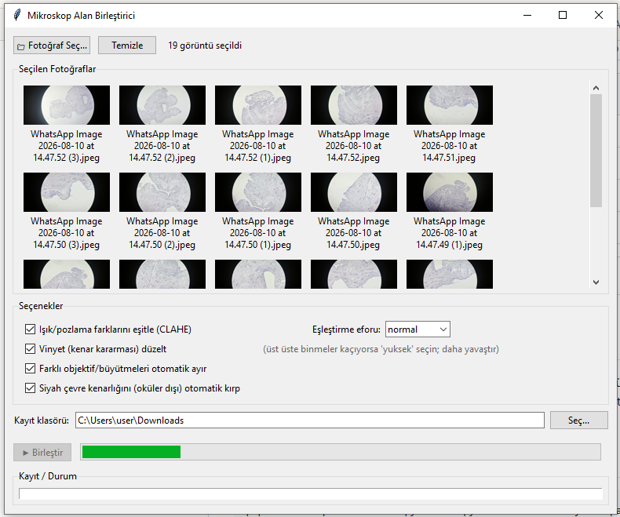
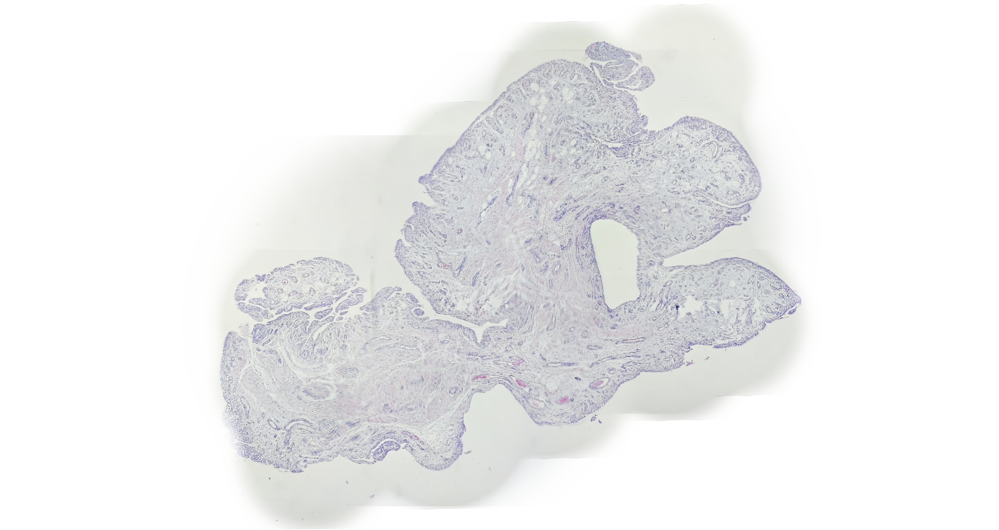
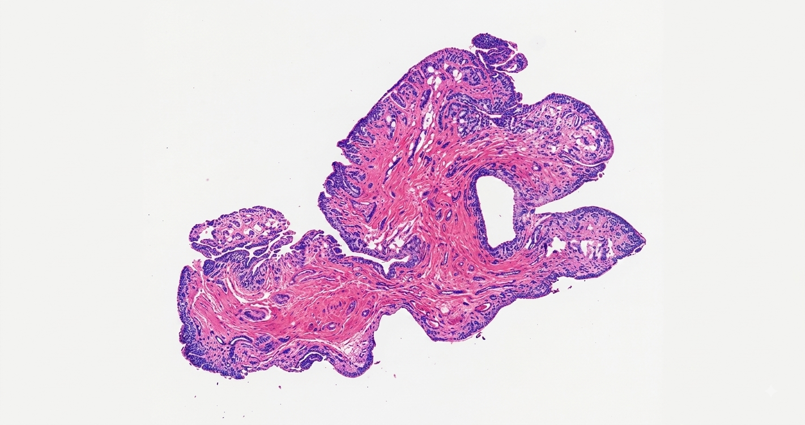

# Microscope Image Stitcher (Pathology & H&E)

Bu proje, standart akıllı telefon kameraları ve mikroskop okülerinden çekilen çoklu histopatoloji görüntülerini yüksek çözünürlüklü tek bir "Whole Slide Image" (Bütünleşik Kesit) haline getirmek için geliştirilmiş özel bir Python aracıdır.

Standart panorama birleştirme algoritmaları (örn. OpenCV Stitcher), mikroskop görüntülerini işlerken perspektif bozulmalarına ve "esneme" artefaktlarına neden olur. Bu araç, sadece patoloji kesitleri için optimize edilmiş özel bir "Rigid Affine" (Katı) hizalama ve "Alpha-Feathering" harmanlama motoru kullanır.

## Özellikler

*   **Siyah Oküler Artefaktı Giderici:** Mikroskop merceğinin neden olduğu dairesel siyah çerçeveleri otomatik tanır ve şeffaflaştırır.
*   **Alpha-Feathering Harmanlama:** Resimlerin kesişim noktalarındaki sert çizgileri ve ızgara izlerini (seams) tüy gibi yumuşak bir geçişle yok eder.
*   **Renk Koruması:** Standart harmanlama yöntemlerinin aksine, hücre çekirdeklerinin (Hematoksilen) ve sitoplazmanın (Eozin) orijinal renk değerlerine dokunmaz.
*   **Lanczos4 Yüksek Çözünürlük Motoru:** Görüntüleri kaydırırken veya döndürürken hücre detaylarında piksel kaybı yaşanmasını önler.
*   **Kullanıcı Dostu GUI:** PyQt5 tabanlı basit arayüzü sayesinde kod bilmeden resimler seçilip birleştirilebilir.

## Ekran Görüntüleri ve Sonuçlar

**Kullanıcı Arayüzü**


**Ham Birleştirme Sonucu (Alpha-Feathering ile İzlerin Yok Edilmesi)**


**Yapay Zeka (AI) H&E Renk İyileştirmesi Sonrası**
*(Dijital boyama/kontrast artırma ile elde edilen final histopatoloji görüntüsü)*


## Kurulum ve Kullanım

Sisteminize Python yüklü olduktan sonra aşağıdaki kütüphaneleri kurmanız gerekmektedir:

```bash
pip install opencv-python numpy PyQt5
