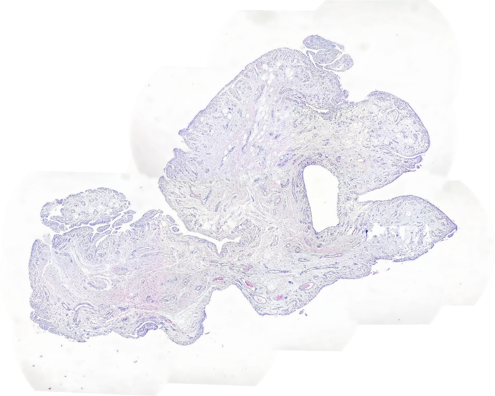
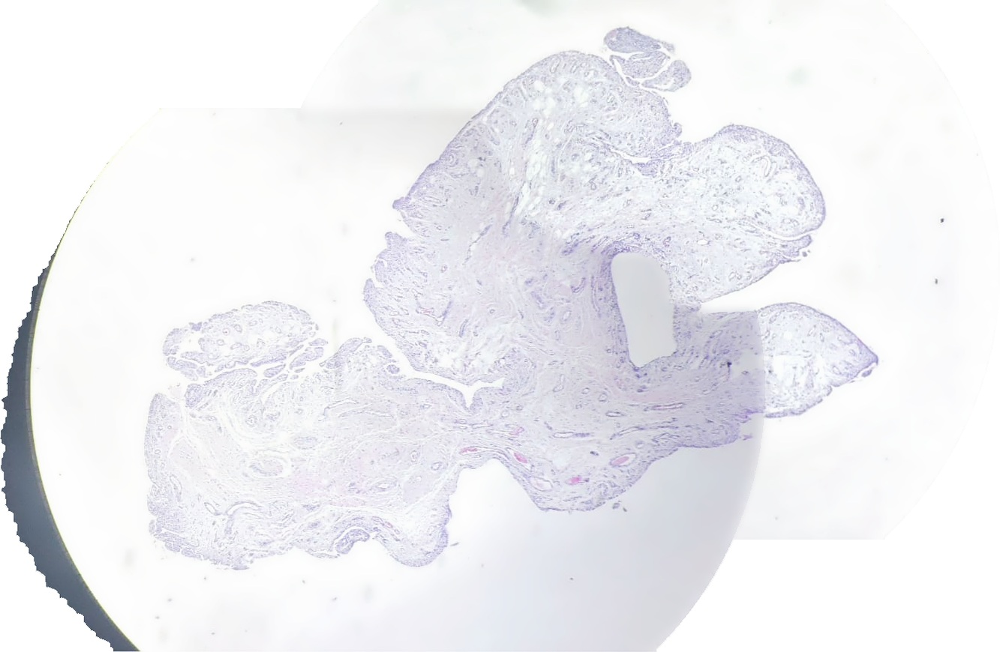

# MicroStitch Studio sample dataset

This directory contains a real example acquisition and the outputs generated from it. Its purpose is to make the repository immediately testable and to provide a reference case for future algorithm changes.

## Directory layout

```text
sample/
├─ sample_images/
│  └─ overlapping smartphone-through-microscope JPEG images
└─ sample_MicroStitch_Output/
   ├─ objective_1.png
   ├─ objective_1_preview.jpg
   ├─ objective_1.ome.tif
   ├─ objective_2.png
   ├─ objective_2_preview.jpg
   ├─ objective_2.ome.tif
   └─ stitch_report.json
```

## Input images

`sample_images/` contains overlapping microscope photographs from the same acquisition session. The set intentionally contains images that the program can interpret as more than one scale/objective group.

This is useful because MicroStitch Studio should **not** blindly force all frames into one resolution layer. Mixing substantially different magnifications can create local blur or duplicated nuclear contours.

## Example output

### Objective group 1

[](sample_MicroStitch_Output/objective_1.png)

- [Full PNG](sample_MicroStitch_Output/objective_1.png)
- [Pyramidal OME-TIFF](sample_MicroStitch_Output/objective_1.ome.tif)
- [Preview JPEG](sample_MicroStitch_Output/objective_1_preview.jpg)

### Objective group 2

[](sample_MicroStitch_Output/objective_2.png)

- [Full PNG](sample_MicroStitch_Output/objective_2.png)
- [Pyramidal OME-TIFF](sample_MicroStitch_Output/objective_2.ome.tif)
- [Preview JPEG](sample_MicroStitch_Output/objective_2_preview.jpg)

### Quality / processing report

[`stitch_report.json`](sample_MicroStitch_Output/stitch_report.json) records the processing settings and detailed tile/matching information used for this result.

For the included run, the report begins with the Balanced-style settings used by the current pipeline, including SIFT feature count, RANSAC threshold, graph-cut seam mode, pyramidal TIFF output, and objective grouping parameters.

## Reproducing the sample

From the repository root:

```bash
python MicroStitch_Studio.py
```

Then:

1. Add all files from `sample/sample_images/`.
2. Select an output folder outside `sample/sample_MicroStitch_Output/` so the checked-in reference is not overwritten accidentally.
3. Start with **Balanced** quality.
4. Use **graphcut** seam mode.
5. Leave hybrid/mixed-objective rendering disabled for the baseline comparison.
6. Run stitching.
7. Compare the new output with the checked-in reference images and JSON report.

Exact pixel-for-pixel equality is not always required when dependencies or algorithms change. What matters is whether the new result improves or preserves registration quality, tissue geometry, nuclear detail, color consistency, and seam visibility.

## Regression checklist

When modifying the stitching engine, compare:

- number of objective groups
- accepted and rejected pairwise matches
- median registration error
- canvas dimensions
- visible duplicated nuclei
- local blur at overlaps
- seam visibility
- H&E color shifts
- white-background consistency
- inclusion/exclusion of the black eyepiece border

A visually smoother image is not automatically an improvement if microscopic structures are duplicated or geometrically distorted.

## Updating this reference

The sample output may be updated when the algorithm demonstrably improves. When doing so:

1. Keep the original `sample_images/` unchanged unless there is a separate reason to revise the dataset.
2. Document the algorithm/settings change in the commit or pull request.
3. Replace the relevant output files together so the PNG, preview, OME-TIFF, and JSON report correspond to the same run.
4. Mention registration/color/geometry changes in the PR description.

## Privacy

Do not add public sample data containing patient identifiers or protected health information. Example material should be de-identified and suitable for public distribution.
